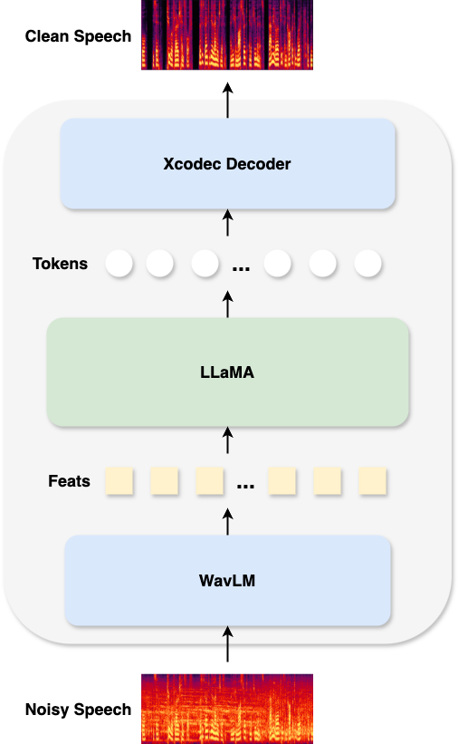

# **LLaSE: Maximizing Acoustic Preservation for LLaMA-based Speech Enhancement**  

Boyi Kang\*¹, Xinfa Zhu\*¹, Zihan Zhang¹, Zhen Ye², Ziqian Wang¹, Lei Xie¹  
¹ **Audio, Speech and Language Processing Group (ASLP@NPU)**,  
School of Computer Science, Northwestern Polytechnical University, Xi’an, China  
² **The Hong Kong University of Science and Technology**

---

## Abstract
Language Models (LMs) have shown strong capabilities in semantic understanding and contextual modeling, making them promising for speech enhancement. Building on SELM, our previous work that first introduced LMs to speech enhancement, we note that SELM and other existing generative speech enhancement approaches still face challenges, such as variations in timbre and content before and after enhancement. To address these limitations, we propose LLaSE, which utilizes continuous representations from WavLM and integrates a LLaMA backbone combined with the more powerful Xcodec2 decoder, significantly improving contextual modeling capabilities and enabling more accurate and stable enhancement. Experimental results demonstrate that LLaSE achieves state-of-the-art performance on speech enhancement, offering a robust and scalable solution for speech enhancement.

## Demo Page

Demo Page: https://kevin-naticl.github.io/LLaSE-Demopage/



## DNSMOS results on DNS Challenge testset


## Usage

### 1. Clone the Repo
```bash
git clone https://github.com/Kevin-naticl/LLaSE.git
cd LLaSE
```

### 2. Install Requirements
```bash
conda create -n LLaSE python=3.10
conda activate LLaSE
pip install -r requirements.txt
```

### 3. Download the Checkpoint from Hugging Face
You can use the provided shell script to download the checkpoint or manually download it from [Hugging Face](https://huggingface.co/).

```bash
cd ckpt
bash download.sh
```

### 4. Inference
1. Provide the file list in `./config/test.yml`.
2. Run the inference script:

```bash
bash inference.sh
```

The processed `.wav` files will be saved in `./decode/wav` by default (16k sample rate).

---

### Future Updates
- A Python module will be available in the future.